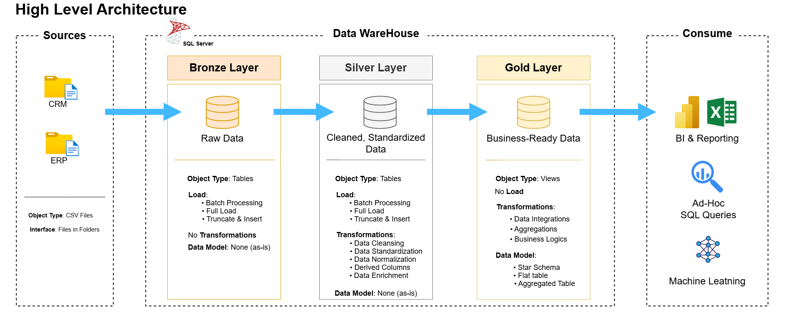
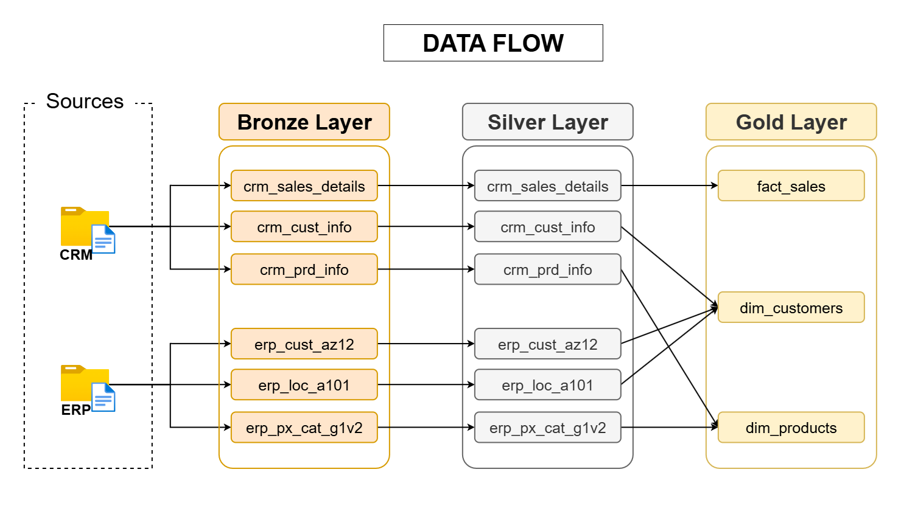
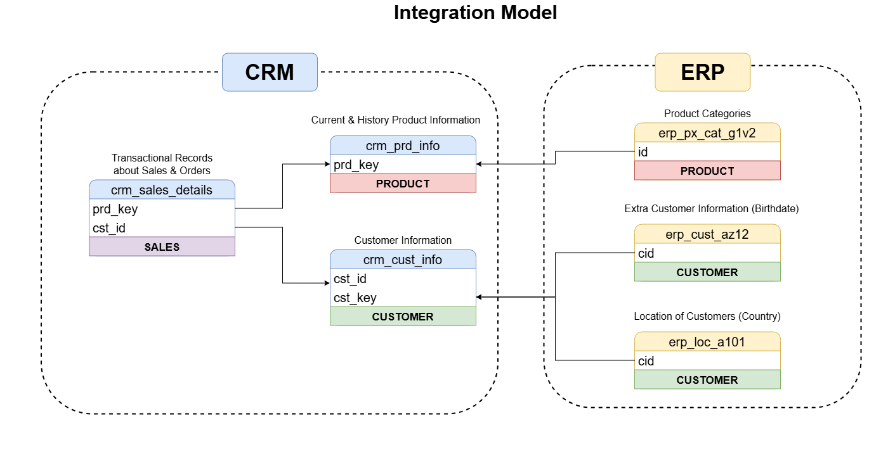
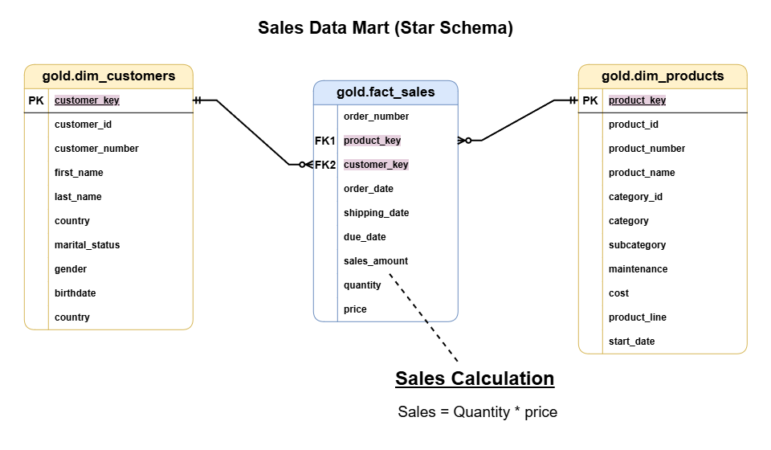

# 🏛️ Data Warehouse and Analytics Project


Welcome to the **Data Warehouse and Analytics Project** repository!

This project demonstrates a comprehensive data warehousing and analytics solution, from building a modern data warehouse to generating actionable business insights. Designed as a **portfolio project**, it highlights industry best practices in **data engineering** and **analytics**.

---

## 📖 Table of Contents

- [Overview](#-overview)
- [Data Architecture](#️-data-architecture)
- [Data Flow](#-data-flow)
- [Data Integration Model](#-data-integration-model)
- [Sales Data Mart (Star Schema)](#-sales-data-mart-star-schema)
- [Repository Structure](#-repository-structure)
- [Project Requirements](#-project-requirements)
- [Data Catalog](#-data-catalog)
- [Tech Stack](#️-tech-stack)
- [License](#-license)

---

## 🎯 Overview

The goal of this project is to consolidate sales data coming from two separate source systems (**ERP** and **CRM**) into a single, clean, and analytics-ready data warehouse built on **Microsoft SQL Server**.

The project covers the full lifecycle:

- **Data Engineering** — designing and building the data warehouse using the **Medallion Architecture** (Bronze → Silver → Gold).
- **Data Modeling** — integrating multiple sources into a user-friendly **star schema**.
- **Data Analytics** — writing SQL-based analytics to surface insights on customer behavior, product performance, and sales trends.

---

## 🏗️ Data Architecture

The data warehouse follows the **Medallion Architecture** with three progressive layers:



| Layer | Purpose | Object Type | Load | Transformations | Data Model |
|-------|---------|-------------|------|-----------------|------------|
| **Bronze** | Raw data, stored as-is from sources | Tables | Batch · Full Load · Truncate & Insert | None (as-is) | None |
| **Silver** | Cleaned & standardized data | Tables | Batch · Full Load · Truncate & Insert | Cleansing, Standardization, Normalization, Derived Columns, Enrichment | None |
| **Gold** | Business-ready data | Views | No Load | Integration, Aggregation, Business Logic | Star Schema · Flat Table · Aggregated Table |

**Sources:** CSV files from CRM and ERP systems.
**Consumption:** BI & Reporting (Power BI), Ad-Hoc SQL Queries, and Machine Learning.

---

## 🔄 Data Flow

The diagram below traces how each source table moves through the Bronze, Silver, and Gold layers to build the final analytical objects.



- `crm_sales_details` → **fact_sales**
- `crm_cust_info` + `erp_cust_az12` + `erp_loc_a101` → **dim_customers**
- `crm_prd_info` + `erp_px_cat_g1v2` → **dim_products**

---

## 🔗 Data Integration Model

This model shows how the CRM and ERP tables relate to one another and how their keys are joined during integration.



- **CRM** provides transactional sales records, product info, and core customer info.
- **ERP** enriches the model with product categories, customer birthdates, and customer locations (country).

---

## ⭐ Sales Data Mart (Star Schema)

The Gold layer exposes a clean **star schema** optimized for analytical queries, with a central fact table surrounded by dimension tables.



- **`gold.fact_sales`** — the central fact table (grain: one row per sales line item).
- **`gold.dim_customers`** — customer dimension enriched with demographic & geographic data.
- **`gold.dim_products`** — product dimension with attributes and categories.

>  **Sales Calculation:** `sales_amount = quantity × price`

---

## 📂 Repository Structure

```
sql-data-warehouse-project/
│
├── datasets/                 # Raw source data (CRM & ERP CSV files)
│   ├── source_crm/
│   │   ├── cust_info.csv
│   │   ├── prd_info.csv
│   │   └── sales_details.csv
│   └── source_erp/
│       ├── CUST_AZ12.csv
│       ├── LOC_A101.csv
│       └── PX_CAT_G1V2.csv
│
├── docs/                     # Project documentation & diagrams
│   ├── data_catalog.md       # Catalog of the Gold layer (tables & columns)
│   └── diagrammes/           # Architecture & data model diagrams (.png)
│       ├── Data_Warehouse_Architecture.drawio.png
│       ├── DATA_FLOW.drawio.png
│       ├── Integration_Model.drawio.png
│       └── Sales_Data_Mart.drawio.png
│
├── scripts/                  # SQL scripts for the ETL pipeline
│   ├── bronze/               # Load raw data into the Bronze layer
│   │   ├── ddl_bronze.sql
│   │   └── proc_load_bronze.sql
│   ├── silver/               # Clean & transform data into the Silver layer
│   │   ├── ddl_silver.sql
│   │   └── proc_load_silver.sql
│   ├── gold/                 # Build business-ready views (Gold layer)
│   │   └── ddl_gold.sql
│   └── init_database.sql
│   
├── tests/                    # Data quality checks & validation scripts
│   ├── quality_checks_gold.sql
│   └── quality_checks_silver.sql
│
├── LICENSE                   # MIT License 
└── README.md                 # Project overview (this file)
```

---

## 📋 Project Requirements

### 🛠️ Building the Data Warehouse (Data Engineering)

#### Objective
Develop a modern data warehouse using **SQL Server** to consolidate sales data, enabling analytical reporting and informed decision-making.

#### Specifications
- **Data Sources:** Import data from two source systems (ERP and CRM) provided as CSV files.
- **Data Quality:** Cleanse and resolve data quality issues prior to analysis.
- **Integration:** Combine both sources into a single, user-friendly data model designed for analytical queries.
- **Scope:** Focus on the latest dataset only; historization of data is not required.
- **Documentation:** Provide clear documentation of the data model to support both business stakeholders and analytics teams.

### 📊 BI: Analytics & Reporting (Data Analytics)

#### Objective
Develop SQL-based analytics to deliver detailed insights into:

- **Customer Behavior**
- **Product Performance**
- **Sales Trends**

These insights empower stakeholders with key business metrics, enabling strategic decision-making.

---

## 📚 Data Catalog

A detailed description of every table and column in the **Gold layer** (dimensions and facts) is available here: [`docs/data_catalog.md`](docs/data_catalog.md)

It documents `gold.dim_customers`, `gold.dim_products`, and `gold.fact_sales`, including data types and business descriptions.

---

## 🛠️ Tech Stack

- **Database:** Microsoft SQL Server
- **Language:** SQL (T-SQL)
- **Modeling:** Medallion Architecture (Bronze / Silver / Gold), Star Schema
- **Diagrams:** draw.io
- **Consumption:** Power BI · Excel · Ad-Hoc SQL · Machine Learning

---

## 📜 License

This project is licensed under the [MIT License](LICENSE). You are free to use, modify, and share this project with proper attribution.
